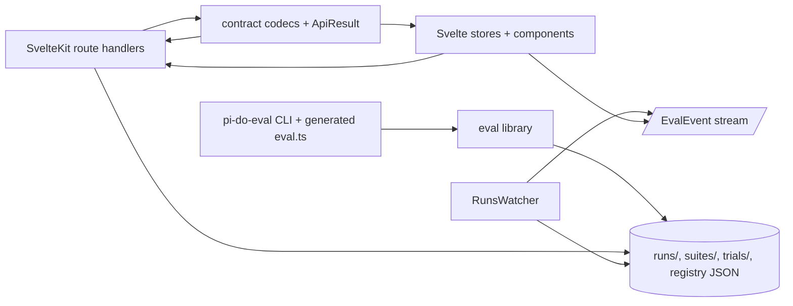

# Engineering Quality Refactor Whiteboard

## Goal

Refactor the codebase so the eval library, SvelteKit server routes, stores, and CLI share explicit runtime contracts instead of relying on repeated JSON casts, duplicated route logic, and ad hoc file readers. The first pass must preserve the published package exports, generated harness behavior, current file formats, and UI routes.

## Surface today

- Package public API: `package.json:6` exports the eval library, `package.json:8` exports server config, and `package.json:10` exposes `pi-do-eval`.
- Eval public types: `src/lib/eval/types.ts:72` defines `EvalPlugin`, `src/lib/eval/types.ts:142` defines `EvalReport`, `src/lib/eval/types.ts:201` defines `SuiteReport`, `src/lib/eval/types.ts:267` defines `RunIndexEntry`, `src/lib/eval/types.ts:292` defines `EvalEvent`, and `src/lib/eval/types.ts:398` defines `LauncherConfig`.
- Runner contract: `runEval(opts: RunOptions): Promise<RunResult>` starts Pi, streams optional live files/events, and returns parsed session state at `src/lib/eval/runner.ts:50`.
- Report files: `writeReport(report, runDir)` writes `report.json` and `report.md` at `src/lib/eval/reporter.ts:17`; `updateRunIndex(runsDir, emit?)` derives `runs/index.json` from `report.json` or `status.json` at `src/lib/eval/reporter.ts:27`.
- Suite files: file-backed suite definitions are JSON under `suites/`, shaped by `SuiteDefinition` at `src/lib/eval/suite-files.ts:4` and read/written by `loadFileSuites`/`writeFileSuite` at `src/lib/eval/suite-files.ts:26` and `src/lib/eval/suite-files.ts:56`.
- Trial metadata files: `TrialMeta` is `description?`, `tags?`, `enabled?` at `src/lib/eval/trial-meta.ts:4`, persisted to `trials/<name>/meta.json` by `writeTrialMeta` at `src/lib/eval/trial-meta.ts:39`.
- Project registry file: `RegisteredProject` and `ProjectRegistry` are defined at `src/lib/server/projects.ts:6` and `src/lib/server/projects.ts:16`; registry path is derived at `src/lib/server/projects.ts:29`.
- Active run registry: launcher persists one active run per project as `active-runs.json` with `PersistedActiveRun` at `src/lib/server/launcher.ts:17`, while in-memory process state is `ActiveRun` at `src/lib/server/launcher.ts:7`.
- Launcher request path: route bodies are cast to `RunRequest` at `src/routes/api/launcher/+server.ts:43` and `src/routes/api/projects/[projectId]/launcher/+server.ts:46`; `spawnRun` validates and spawns at `src/lib/server/launcher.ts:181`.
- Project-scoped API routes: project CRUD and selection routes return raw registry/error objects at `src/routes/api/projects/+server.ts:6`, `src/routes/api/projects/+server.ts:11`, `src/routes/api/projects/select/+server.ts:5`, and `src/routes/api/projects/[projectId]/+server.ts:6`.
- Editable suite/trial routes: file suite route bodies are cast at `src/routes/api/projects/[projectId]/suites/+server.ts:17` and `src/routes/api/projects/[projectId]/suites/[name]/+server.ts:15`; trial meta bodies are cast at `src/routes/api/projects/[projectId]/trials/[name]/+server.ts:18`.
- SSE contract: `/api/projects/:projectId/events` streams `EvalEvent` JSON at `src/routes/api/projects/[projectId]/events/+server.ts:5`; `RunsWatcher` emits derived events from files at `src/lib/server/watcher.ts:10`.
- Browser stores consume the same contracts with unchecked casts: project registry at `src/stores/projects.ts:13`, launcher config/action at `src/stores/launcher.ts:21`, run/suite/bench report loading at `src/stores/runs.ts:135`, and SSE events at `src/stores/sse.ts:50`.
- Generated harness contract: `pi-do-eval init` writes `eval.config.ts`, `eval.ts`, plugin, trial config, and task files at `cli/init.ts:54`; templates define the generated `EvalConfig` at `cli/templates.ts:105` and generated run/report behavior at `cli/templates.ts:166`.
- Existing proof patterns: file format round trips and traversal protection are tested in `test/suite-files.test.ts:29`, `test/trial-meta.test.ts:27`, `test/projects.test.ts:27`, `test/launcher.test.ts:61`, and `test/server.test.ts:26`.

## Surface after

- Package exports stay source-compatible:
  ```json
  { ".": "./src/lib/eval/index.ts", "./server/config": "./src/lib/server/config.ts" }
  ```
- New internal contract module:
  ```ts
  // src/lib/contracts/index.ts
  export type ApiResult<T> = { ok: true; data: T } | { ok: false; error: ApiError };
  export interface ApiError { code: string; message: string; status: number }
  export interface JsonCodec<T> {
    parse(value: unknown): { ok: true; value: T } | { ok: false; issues: string[] };
    serialize(value: T): unknown;
  }
  ```
- File contracts become named codecs, preserving on-disk JSON shapes:
  ```ts
  export const projectRegistryCodec: JsonCodec<ProjectRegistry>;
  export const activeRunsRegistryCodec: JsonCodec<Record<string, PersistedActiveRun>>;
  export const trialMetaCodec: JsonCodec<TrialMeta>;
  export const suiteDefinitionCodec: JsonCodec<SuiteDefinition>;
  export const evalReportCodec: JsonCodec<EvalReport>;
  export const suiteReportCodec: JsonCodec<SuiteReport>;
  export const runIndexCodec: JsonCodec<RunIndexEntry[]>;
  ```
- Route request/response surfaces become named:
  ```ts
  export type ProjectRegistryResponse = ApiResult<ProjectRegistry>;
  export type LauncherConfigResponse = ApiResult<LauncherConfig>;
  export type LauncherActionResponse = ApiResult<{ id: string }>;
  export type SuiteListResponse = ApiResult<{ suites: SuiteDefinition[] }>;
  export type TrialMetaResponse = ApiResult<{ meta: TrialMeta }>;
  ```
- `RunRequest` becomes a strict discriminated union:
  ```ts
  type RunRequest =
    | { type: "trial"; trial: string; variant: string; model?: string; noJudge?: boolean }
    | { type: "suite"; suite: string; model?: string; noJudge?: boolean }
    | { type: "bench"; suite: string; model?: string; noJudge?: boolean };
  ```
- Route handlers delegate repeated runtime/error handling through one local helper:
  ```ts
  withProjectRuntime(projectId, handler): Promise<Response>
  parseJsonBody<T>(request, codec): ApiResult<T>
  jsonResult<T>(result: ApiResult<T>): Response
  ```
- Browser stores consume response wrappers through shared client helpers:
  ```ts
  apiGet<T>(path, codec): Promise<T>
  apiPost<TBody, TResponse>(path, body, bodyCodec, responseCodec): Promise<TResponse>
  ```
- Existing deprecated active-project routes remain as compatibility aliases:
  ```text
  /api/launcher -> active project launcher
  /api/events -> active project events
  /api/projects/:projectId/* -> canonical project-scoped routes
  ```

## Data shapes and invariants

- Unknown JSON is untrusted at every boundary: request bodies, config files, report files, registry files, SSE payloads, and generated harness imports.
- `ApiResult<T>` makes success/error state explicit; a response cannot contain both data and error.
- `RunRequest` makes illegal launch combinations unrepresentable: trials require `trial + variant`; suites and benches require `suite`.
- Registries remain tolerant on read but normalized on write: corrupt files return empty/default state, valid unknown fields are ignored, and writes use canonical sorted/minimal JSON.
- File formats are backward compatible: existing `report.json`, `runs/index.json`, `suites/index.json`, `active-runs.json`, `projects.json`, `suites/*.json`, and `trials/*/meta.json` continue to load.
- Live run states stay explicit: `running` may transition to `completed`, `timeout`, `crashed`, or `stalled`; completed reports are authoritative over stale `status.json`.
- Client stores no longer treat unchecked `fetch().json()` payloads as valid domain state.

## Diagram



## Patterns followed

- The repo already has strict TypeScript and `noUncheckedIndexedAccess` enabled at `tsconfig.json:11` and `tsconfig.json:12`.
- File boundary helpers already exist for suite/trial names and path traversal: `validateSuiteName` at `src/lib/eval/suite-files.ts:18`, `validateTrialName` at `src/lib/eval/trial-meta.ts:17`, and `createRunsFileResponse` at `src/lib/server/run-files.ts:10`.
- Tests use temp directories and black-box round trips for file contracts, e.g. `test/suite-files.test.ts:107`, `test/trial-meta.test.ts:60`, and `test/projects.test.ts:47`.
- Long-lived process state is already isolated enough to reset in tests through `resetLauncherState` at `src/lib/server/launcher.ts:83`.

## Resolved decisions

- Keep this refactor compatibility-preserving; no package export, file path, route path, or generated harness behavior changes in the first pass.
- Treat runtime JSON parsing as the main engineering-quality target because it crosses library, server, store, CLI, and persisted-file boundaries.
- Keep file-backed configuration as the source of truth for current local operation; no database migration is included.
- Prefer small local contract helpers over adding a schema dependency unless validation complexity proves otherwise.

## Open questions

- Should `ApiResult<T>` be visible only inside the app, or exported for external consumers building against the local HTTP API?
- Should malformed persisted reports be skipped as today, or surfaced to the UI as recoverable diagnostics?
- Should active-project routes under `/api/launcher` and `/api/events` stay indefinitely or be marked deprecated after project-scoped routes cover all consumers?
- Should generated harness `types.ts` be aligned with core exported types, or intentionally remain a scaffold-local teaching surface?

## Out of scope

- Reworking the dashboard/project-management information architecture from `docs/design.md`.
- Changing scoring, regression comparison, judge behavior, sandbox behavior, or Pi subprocess semantics.
- Introducing a database or remote service.
- Redesigning the UI visual layer.
- Changing on-disk report/index naming conventions.

## Proof obligations

- Existing tests pass unchanged before and after the refactor.
- Codec tests cover valid, partial, corrupt, and unknown-field payloads for each persisted file contract.
- Route tests cover canonical project-scoped launcher, suites, trial meta, and project registry success/error responses.
- Store tests cover rejected malformed responses and confirm state is not partially mutated on parse failure.
- Compatibility tests load fixture-style legacy `report.json`, `runs/index.json`, `suites/index.json`, `projects.json`, and `active-runs.json`.
- Generated harness tests confirm `pi-do-eval init` still writes the same public files and still produces viewer-readable run artifacts.

## Sign-off

Approver: TBD
Date: TBD
